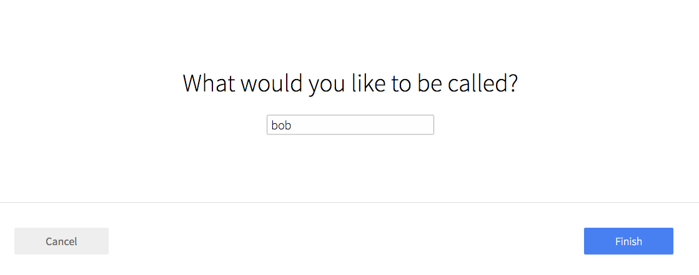

# Form: Profile Name

Set a user name (modal form)



```jsx
import ModalBtn from 'patchkit-modal/btn'
import FormProfileName from 'patchkit-form-profile-name'

const onSubmit = (name, cb) => { console.log('submit', name); cb() }
<ModalBtn className="fullheight" Form={FormProfileName} formProps={{currentValue: 'bob', className: 'text-center vertical-center', onSubmit: onSubmit}}>
  <a className="btn highlighted">Click to open</a>
</ModalBtn>
```

If the rename is for another user than the local user, set the `isOtherUser` prop on the form to true.